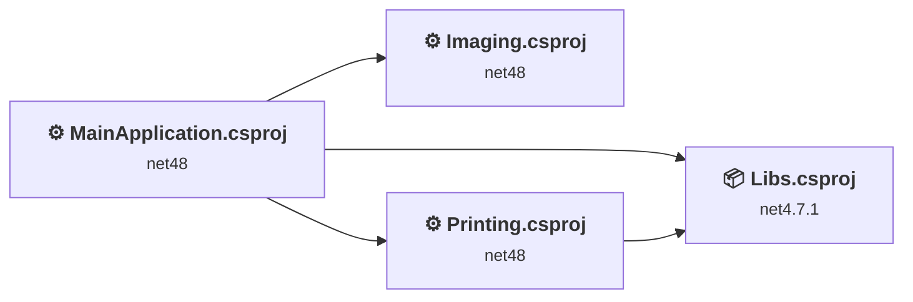
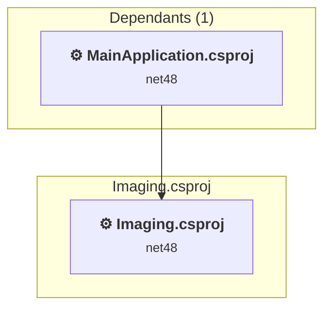
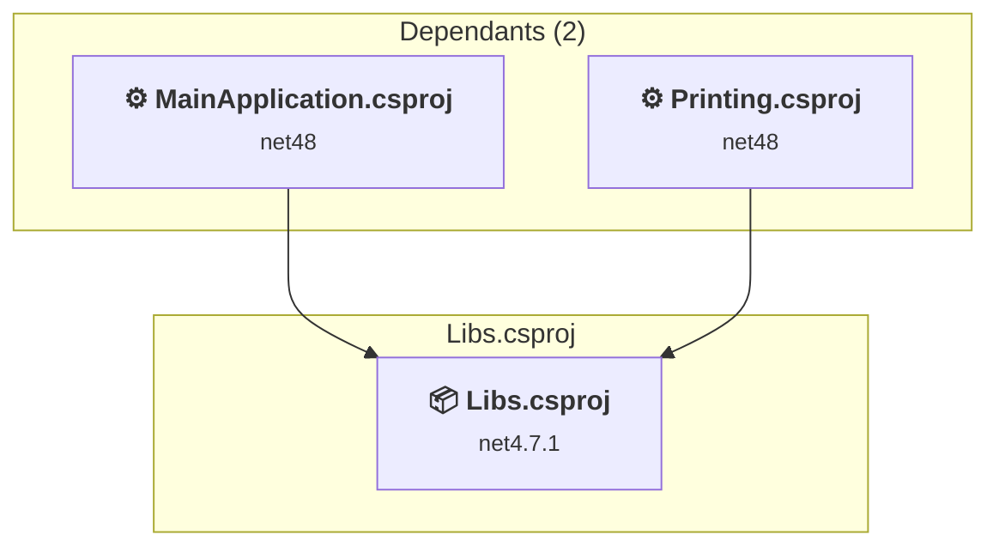
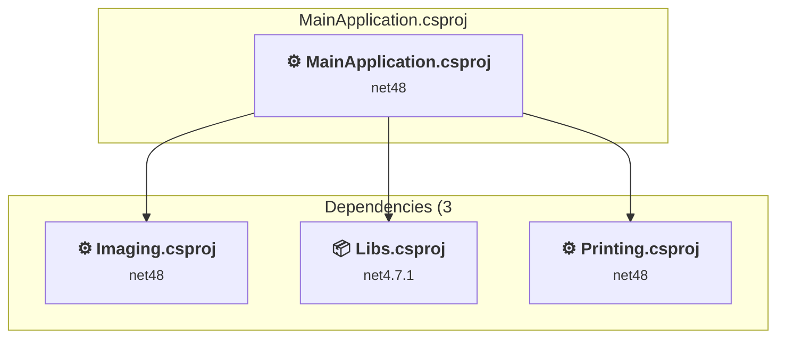
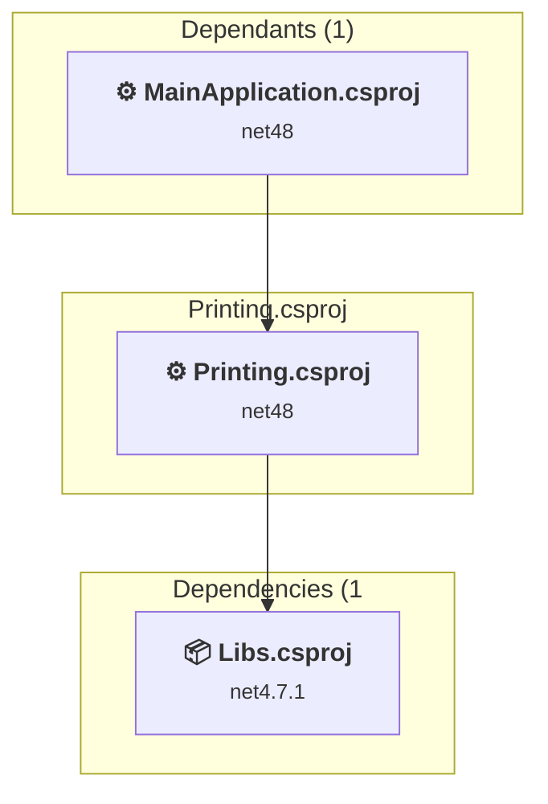

# Projects and dependencies analysis

This document provides a comprehensive overview of the projects and their dependencies in the context of upgrading to .NETCoreApp,Version=v8.0.

## Table of Contents

- [Executive Summary](#executive-Summary)
  - [Highlevel Metrics](#highlevel-metrics)
  - [Projects Compatibility](#projects-compatibility)
  - [Package Compatibility](#package-compatibility)
  - [API Compatibility](#api-compatibility)
- [Aggregate NuGet packages details](#aggregate-nuget-packages-details)
- [Top API Migration Challenges](#top-api-migration-challenges)
  - [Technologies and Features](#technologies-and-features)
  - [Most Frequent API Issues](#most-frequent-api-issues)
- [Projects Relationship Graph](#projects-relationship-graph)
- [Project Details](#project-details)

  - [Imaging\Imaging\Imaging.csproj](#imagingimagingimagingcsproj)
  - [Libs\Libs.csproj](#libslibscsproj)
  - [MainApplication\MainApplication\MainApplication.csproj](#mainapplicationmainapplicationmainapplicationcsproj)
  - [Printing\Printing\Printing.csproj](#printingprintingprintingcsproj)

## Executive Summary

### Highlevel Metrics

| Metric | Count | Status |
| :--- | :---: | :--- |
| Total Projects | 4 | All require upgrade |
| Total NuGet Packages | 11 | 6 need upgrade |
| Total Code Files | 32 |  |
| Total Code Files with Incidents | 11 |  |
| Total Lines of Code | 3381 |  |
| Total Number of Issues | 137 |  |
| Estimated LOC to modify | 118+ | at least 3.5% of codebase |

### Projects Compatibility

| Project | Target Framework | Difficulty | Package Issues | API Issues | Est. LOC Impact | Description |
| :--- | :---: | :---: | :---: | :---: | :---: | :--- |
| [Imaging\Imaging\Imaging.csproj](#imagingimagingimagingcsproj) | net48 | 🟡 Medium | 0 | 70 | 70+ | ClassicWpf, Sdk Style = False |
| [Libs\Libs.csproj](#libslibscsproj) | net4.7.1 | 🟡 Medium | 1 | 48 | 48+ | Wpf, Sdk Style = True |
| [MainApplication\MainApplication\MainApplication.csproj](#mainapplicationmainapplicationmainapplicationcsproj) | net48 | 🟢 Low | 11 | 0 |  | ClassicWinForms, Sdk Style = False |
| [Printing\Printing\Printing.csproj](#printingprintingprintingcsproj) | net48 | 🟢 Low | 0 | 0 |  | ClassicWpf, Sdk Style = False |

### Package Compatibility

| Status | Count | Percentage |
| :--- | :---: | :---: |
| ✅ Compatible | 5 | 45.5% |
| ⚠️ Incompatible | 1 | 9.1% |
| 🔄 Upgrade Recommended | 5 | 45.5% |
| ***Total NuGet Packages*** | ***11*** | ***100%*** |

### API Compatibility

| Category | Count | Impact |
| :--- | :---: | :--- |
| 🔴 Binary Incompatible | 96 | High - Require code changes |
| 🟡 Source Incompatible | 22 | Medium - Needs re-compilation and potential conflicting API error fixing |
| 🔵 Behavioral change | 0 | Low - Behavioral changes that may require testing at runtime |
| ✅ Compatible | 538 |  |
| ***Total APIs Analyzed*** | ***656*** |  |

## Aggregate NuGet packages details

| Package | Current Version | Suggested Version | Projects | Description |
| :--- | :---: | :---: | :--- | :--- |
| Microsoft.Bcl.AsyncInterfaces | 9.0.4 | 8.0.0 | [MainApplication.csproj](#mainapplicationmainapplicationmainapplicationcsproj) | NuGet package upgrade is recommended |
| Microsoft-WindowsAPICodePack-Core | 1.1.3.3 | 1.1.5 | [MainApplication.csproj](#mainapplicationmainapplicationmainapplicationcsproj) | ⚠️NuGet package is incompatible |
| System.Buffers | 4.5.1 |  | [MainApplication.csproj](#mainapplicationmainapplicationmainapplicationcsproj) | NuGet package functionality is included with framework reference |
| System.IO.Pipelines | 9.0.4 | 8.0.0 | [MainApplication.csproj](#mainapplicationmainapplicationmainapplicationcsproj) | NuGet package upgrade is recommended |
| System.Memory | 4.5.5 |  | [MainApplication.csproj](#mainapplicationmainapplicationmainapplicationcsproj) | NuGet package functionality is included with framework reference |
| System.Numerics.Vectors | 4.5.0 |  | [MainApplication.csproj](#mainapplicationmainapplicationmainapplicationcsproj) | NuGet package functionality is included with framework reference |
| System.Runtime.CompilerServices.Unsafe | 6.0.0 | 6.1.2 | [MainApplication.csproj](#mainapplicationmainapplicationmainapplicationcsproj) | NuGet package upgrade is recommended |
| System.Text.Encodings.Web | 9.0.4 | 8.0.0 | [MainApplication.csproj](#mainapplicationmainapplicationmainapplicationcsproj) | NuGet package upgrade is recommended |
| System.Text.Json | 9.0.4 | 8.0.6 | [Libs.csproj](#libslibscsproj) [MainApplication.csproj](#mainapplicationmainapplicationmainapplicationcsproj) | NuGet package upgrade is recommended |
| System.Threading.Tasks.Extensions | 4.5.4 |  | [MainApplication.csproj](#mainapplicationmainapplicationmainapplicationcsproj) | NuGet package functionality is included with framework reference |
| System.ValueTuple | 4.5.0 |  | [MainApplication.csproj](#mainapplicationmainapplicationmainapplicationcsproj) | NuGet package functionality is included with framework reference |

## Top API Migration Challenges

### Technologies and Features

| Technology | Issues | Percentage | Migration Path |
| :--- | :---: | :---: | :--- |
| WPF (Windows Presentation Foundation) | 78 | 66.1% | WPF APIs for building Windows desktop applications with XAML-based UI that are available in .NET on Windows. WPF provides rich desktop UI capabilities with data binding and styling. Enable Windows Desktop support: Option 1 (Recommended): Target net9.0-windows; Option 2: Add <UseWindowsDesktop>true</UseWindowsDesktop>. |
| GDI+ / System.Drawing | 20 | 16.9% | System.Drawing APIs for 2D graphics, imaging, and printing that are available via NuGet package System.Drawing.Common. Note: Not recommended for server scenarios due to Windows dependencies; consider cross-platform alternatives like SkiaSharp or ImageSharp for new code. |
| Legacy Configuration System | 2 | 1.7% | Legacy XML-based configuration system (app.config/web.config) that has been replaced by a more flexible configuration model in .NET Core. The old system was rigid and XML-based. Migrate to Microsoft.Extensions.Configuration with JSON/environment variables; use System.Configuration.ConfigurationManager NuGet package as interim bridge if needed. |

### Most Frequent API Issues

| API | Count | Percentage | Category |
| :--- | :---: | :---: | :--- |
| T:System.Windows.Media.Imaging.BitmapSource | 20 | 16.9% | Binary Incompatible |
| T:System.Drawing.Bitmap | 15 | 12.7% | Source Incompatible |
| T:System.Windows.Threading.DispatcherTimer | 12 | 10.2% | Binary Incompatible |
| T:System.Windows.Media.Imaging.BitmapFrame | 4 | 3.4% | Binary Incompatible |
| T:System.Windows.Media.Imaging.BitmapCacheOption | 3 | 2.5% | Binary Incompatible |
| P:System.Windows.FrameworkElement.Height | 3 | 2.5% | Binary Incompatible |
| P:System.Windows.FrameworkElement.Width | 3 | 2.5% | Binary Incompatible |
| T:System.Drawing.Imaging.ImageFormat | 2 | 1.7% | Source Incompatible |
| E:System.Windows.Threading.DispatcherTimer.Tick | 2 | 1.7% | Binary Incompatible |
| P:System.Windows.Threading.DispatcherTimer.Interval | 2 | 1.7% | Binary Incompatible |
| M:System.Windows.Threading.DispatcherTimer.#ctor | 2 | 1.7% | Binary Incompatible |
| T:System.Windows.Documents.FixedPage | 2 | 1.7% | Binary Incompatible |
| M:System.Windows.Media.Imaging.BitmapEncoder.Save(System.IO.Stream) | 2 | 1.7% | Binary Incompatible |
| M:System.Windows.Media.Imaging.BitmapFrame.Create(System.Windows.Media.Imaging.BitmapSource) | 2 | 1.7% | Binary Incompatible |
| P:System.Windows.Media.Imaging.BitmapEncoder.Frames | 2 | 1.7% | Binary Incompatible |
| M:System.Windows.Media.Imaging.RenderTargetBitmap.Render(System.Windows.Media.Visual) | 2 | 1.7% | Binary Incompatible |
| T:System.Windows.Media.PixelFormats | 2 | 1.7% | Binary Incompatible |
| T:System.Windows.Media.PixelFormat | 2 | 1.7% | Binary Incompatible |
| P:System.Windows.Media.PixelFormats.Pbgra32 | 2 | 1.7% | Binary Incompatible |
| T:System.Windows.Media.Imaging.RenderTargetBitmap | 2 | 1.7% | Binary Incompatible |
| M:System.Windows.Media.Imaging.RenderTargetBitmap.#ctor(System.Int32,System.Int32,System.Double,System.Double,System.Windows.Media.PixelFormat) | 2 | 1.7% | Binary Incompatible |
| M:System.Configuration.ApplicationSettingsBase.#ctor | 1 | 0.8% | Source Incompatible |
| T:System.Configuration.ApplicationSettingsBase | 1 | 0.8% | Source Incompatible |
| M:System.Windows.Freezable.Freeze | 1 | 0.8% | Binary Incompatible |
| M:System.Windows.Media.Imaging.BitmapImage.EndInit | 1 | 0.8% | Binary Incompatible |
| P:System.Windows.Media.Imaging.BitmapImage.StreamSource | 1 | 0.8% | Binary Incompatible |
| F:System.Windows.Media.Imaging.BitmapCacheOption.OnLoad | 1 | 0.8% | Binary Incompatible |
| P:System.Windows.Media.Imaging.BitmapImage.CacheOption | 1 | 0.8% | Binary Incompatible |
| M:System.Windows.Media.Imaging.BitmapImage.BeginInit | 1 | 0.8% | Binary Incompatible |
| T:System.Windows.Media.Imaging.BitmapImage | 1 | 0.8% | Binary Incompatible |
| M:System.Windows.Media.Imaging.BitmapImage.#ctor | 1 | 0.8% | Binary Incompatible |
| P:System.Drawing.Imaging.ImageFormat.Png | 1 | 0.8% | Source Incompatible |
| M:System.Drawing.Image.Save(System.IO.Stream,System.Drawing.Imaging.ImageFormat) | 1 | 0.8% | Source Incompatible |
| M:System.Windows.Threading.DispatcherTimer.Stop | 1 | 0.8% | Binary Incompatible |
| M:System.Windows.Threading.DispatcherTimer.Start | 1 | 0.8% | Binary Incompatible |
| M:System.Windows.Application.#ctor | 1 | 0.8% | Binary Incompatible |
| T:System.Windows.Application | 1 | 0.8% | Binary Incompatible |
| M:System.Drawing.Bitmap.#ctor(System.IO.Stream) | 1 | 0.8% | Source Incompatible |
| T:System.Windows.Media.Imaging.PngBitmapEncoder | 1 | 0.8% | Binary Incompatible |
| M:System.Windows.Media.Imaging.PngBitmapEncoder.#ctor | 1 | 0.8% | Binary Incompatible |
| M:System.Windows.UIElement.UpdateLayout | 1 | 0.8% | Binary Incompatible |
| T:System.Windows.Rect | 1 | 0.8% | Binary Incompatible |
| M:System.Windows.Rect.#ctor(System.Double,System.Double,System.Double,System.Double) | 1 | 0.8% | Binary Incompatible |
| M:System.Windows.UIElement.Arrange(System.Windows.Rect) | 1 | 0.8% | Binary Incompatible |
| T:System.Windows.Size | 1 | 0.8% | Binary Incompatible |
| M:System.Windows.Size.#ctor(System.Double,System.Double) | 1 | 0.8% | Binary Incompatible |
| M:System.Windows.UIElement.Measure(System.Windows.Size) | 1 | 0.8% | Binary Incompatible |
| T:System.Windows.Media.Imaging.TiffBitmapEncoder | 1 | 0.8% | Binary Incompatible |
| M:System.Windows.Media.Imaging.TiffBitmapEncoder.#ctor | 1 | 0.8% | Binary Incompatible |
| P:System.Windows.FrameworkElement.ActualHeight | 1 | 0.8% | Binary Incompatible |

## Projects Relationship Graph

Legend:
📦 SDK-style project
⚙️ Classic project

## Project Details

### Imaging\Imaging\Imaging.csproj

#### Project Info

- **Current Target Framework:** net48
- **Proposed Target Framework:** net8.0-windows
- **SDK-style**: False
- **Project Kind:** ClassicWpf
- **Dependencies**: 0
- **Dependants**: 1
- **Number of Files**: 10
- **Number of Files with Incidents**: 6
- **Lines of Code**: 1119
- **Estimated LOC to modify**: 70+ (at least 6.3% of the project)

#### Dependency Graph

Legend:
📦 SDK-style project
⚙️ Classic project

### API Compatibility

| Category | Count | Impact |
| :--- | :---: | :--- |
| 🔴 Binary Incompatible | 51 | High - Require code changes |
| 🟡 Source Incompatible | 19 | Medium - Needs re-compilation and potential conflicting API error fixing |
| 🔵 Behavioral change | 0 | Low - Behavioral changes that may require testing at runtime |
| ✅ Compatible | 270 |  |
| ***Total APIs Analyzed*** | ***340*** |  |

#### Project Technologies and Features

| Technology | Issues | Percentage | Migration Path |
| :--- | :---: | :---: | :--- |
| Legacy Configuration System | 2 | 2.9% | Legacy XML-based configuration system (app.config/web.config) that has been replaced by a more flexible configuration model in .NET Core. The old system was rigid and XML-based. Migrate to Microsoft.Extensions.Configuration with JSON/environment variables; use System.Configuration.ConfigurationManager NuGet package as interim bridge if needed. |
| GDI+ / System.Drawing | 17 | 24.3% | System.Drawing APIs for 2D graphics, imaging, and printing that are available via NuGet package System.Drawing.Common. Note: Not recommended for server scenarios due to Windows dependencies; consider cross-platform alternatives like SkiaSharp or ImageSharp for new code. |
| WPF (Windows Presentation Foundation) | 48 | 68.6% | WPF APIs for building Windows desktop applications with XAML-based UI that are available in .NET on Windows. WPF provides rich desktop UI capabilities with data binding and styling. Enable Windows Desktop support: Option 1 (Recommended): Target net9.0-windows; Option 2: Add <UseWindowsDesktop>true</UseWindowsDesktop>. |

### Libs\Libs.csproj

#### Project Info

- **Current Target Framework:** net4.7.1
- **Proposed Target Framework:** net8.0-windows
- **SDK-style**: True
- **Project Kind:** Wpf
- **Dependencies**: 0
- **Dependants**: 2
- **Number of Files**: 3
- **Number of Files with Incidents**: 3
- **Lines of Code**: 235
- **Estimated LOC to modify**: 48+ (at least 20.4% of the project)

#### Dependency Graph

Legend:
📦 SDK-style project
⚙️ Classic project

### API Compatibility

| Category | Count | Impact |
| :--- | :---: | :--- |
| 🔴 Binary Incompatible | 45 | High - Require code changes |
| 🟡 Source Incompatible | 3 | Medium - Needs re-compilation and potential conflicting API error fixing |
| 🔵 Behavioral change | 0 | Low - Behavioral changes that may require testing at runtime |
| ✅ Compatible | 268 |  |
| ***Total APIs Analyzed*** | ***316*** |  |

#### Project Technologies and Features

| Technology | Issues | Percentage | Migration Path |
| :--- | :---: | :---: | :--- |
| GDI+ / System.Drawing | 3 | 6.3% | System.Drawing APIs for 2D graphics, imaging, and printing that are available via NuGet package System.Drawing.Common. Note: Not recommended for server scenarios due to Windows dependencies; consider cross-platform alternatives like SkiaSharp or ImageSharp for new code. |
| WPF (Windows Presentation Foundation) | 30 | 62.5% | WPF APIs for building Windows desktop applications with XAML-based UI that are available in .NET on Windows. WPF provides rich desktop UI capabilities with data binding and styling. Enable Windows Desktop support: Option 1 (Recommended): Target net9.0-windows; Option 2: Add <UseWindowsDesktop>true</UseWindowsDesktop>. |

### MainApplication\MainApplication\MainApplication.csproj

#### Project Info

- **Current Target Framework:** net48
- **Proposed Target Framework:** net8.0-windows
- **SDK-style**: False
- **Project Kind:** ClassicWinForms
- **Dependencies**: 3
- **Dependants**: 0
- **Number of Files**: 12
- **Number of Files with Incidents**: 1
- **Lines of Code**: 1228
- **Estimated LOC to modify**: 0+ (at least 0.0% of the project)

#### Dependency Graph

Legend:
📦 SDK-style project
⚙️ Classic project

### API Compatibility

| Category | Count | Impact |
| :--- | :---: | :--- |
| 🔴 Binary Incompatible | 0 | High - Require code changes |
| 🟡 Source Incompatible | 0 | Medium - Needs re-compilation and potential conflicting API error fixing |
| 🔵 Behavioral change | 0 | Low - Behavioral changes that may require testing at runtime |
| ✅ Compatible | 0 |  |
| ***Total APIs Analyzed*** | ***0*** |  |

### Printing\Printing\Printing.csproj

#### Project Info

- **Current Target Framework:** net48
- **Proposed Target Framework:** net8.0-windows
- **SDK-style**: False
- **Project Kind:** ClassicWpf
- **Dependencies**: 1
- **Dependants**: 1
- **Number of Files**: 10
- **Number of Files with Incidents**: 1
- **Lines of Code**: 799
- **Estimated LOC to modify**: 0+ (at least 0.0% of the project)

#### Dependency Graph

Legend:
📦 SDK-style project
⚙️ Classic project

### API Compatibility

| Category | Count | Impact |
| :--- | :---: | :--- |
| 🔴 Binary Incompatible | 0 | High - Require code changes |
| 🟡 Source Incompatible | 0 | Medium - Needs re-compilation and potential conflicting API error fixing |
| 🔵 Behavioral change | 0 | Low - Behavioral changes that may require testing at runtime |
| ✅ Compatible | 0 |  |
| ***Total APIs Analyzed*** | ***0*** |  |

